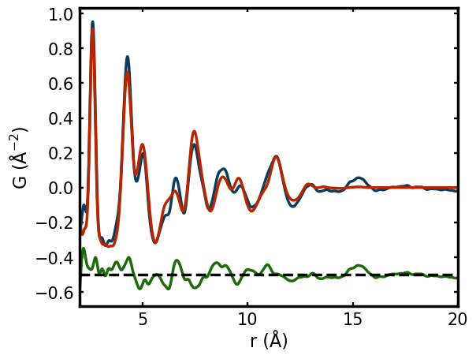
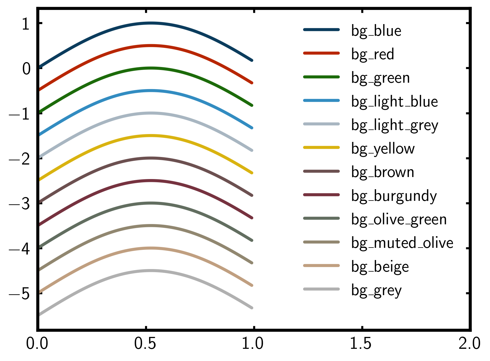

bg-mpl-stylesheets
==================

|PyPi| |Forge| |PythonVersion| |PR|

|Codecov| |Black| |Tracking|

.. |Black| image:: https://img.shields.io/badge/code_style-black-black
        :target: https://github.com/psf/black

.. |Codecov| image:: https://codecov.io/gh/Billingegroup/bg-mpl-stylesheets/branch/main/graph/badge.svg
        :target: https://codecov.io/gh/Billingegroup/bg-mpl-stylesheets

.. |Forge| image:: https://img.shields.io/conda/vn/conda-forge/bg-mpl-stylesheets
        :target: https://anaconda.org/conda-forge/bg-mpl-stylesheets

.. |PR| image:: https://img.shields.io/badge/PR-Welcome-29ab47ff

.. |PyPi| image:: https://img.shields.io/pypi/v/bg-mpl-stylesheets
        :target: https://pypi.org/project/bg-mpl-stylesheets/

.. |PythonVersion| image:: https://img.shields.io/pypi/pyversions/bg-mpl-stylesheets
        :target: https://pypi.org/project/bg-mpl-stylesheets/

.. |Tracking| image:: https://img.shields.io/badge/issue_tracking-github-blue
        :target: https://github.com/Billingegroup/bg-mpl-stylesheets/issues

A package for using Billinge group style files

* bg-mpl-stylesheets is a Python software package that creates a standardized matplotlib figure format. This includes specialized fonts, figure border, color cycle, tick parameters, and more. 

Citation
--------

If you use bg-mpl-stylesheets in a scientific publication, we would like you to cite this package as

        bg-mpl-stylesheets Package, https://github.com/Billingegroup/bg-mpl-stylesheets

Installation
------------

The preferred method is to use `Miniconda Python
<https://docs.conda.io/projects/miniconda/en/latest/miniconda-install.html>`_
and install from the "conda-forge" channel of Conda packages.

To add "conda-forge" to the conda channels, run the following in a terminal. ::

        conda config --add channels conda-forge

We want to install our packages in a suitable conda environment.
The following creates and activates a new environment named ``bg-mpl-stylesheets_env`` ::

        conda create -n bg-mpl-stylesheets_env python=3
        conda activate bg-mpl-stylesheets_env

Then, to fully install ``bg-mpl-stylesheets`` in our active environment, run ::

        conda install --file requirements/examples.txt
        conda install bg-mpl-stylesheets

Another option is to use ``pip`` to download and install the latest release from
`Python Package Index <https://pypi.python.org>`_.
To install using ``pip`` into your ``bg-mpl-stylesheets_env`` environment, we will also have to install dependencies ::

        pip install -r https://raw.githubusercontent.com/billingegroup/bg-mpl-stylesheets/main/requirements/run.txt

and then install the package ::

        pip install bg-mpl-stylesheets

If you prefer to install from sources, after installing the dependencies, obtain the source archive from
`GitHub <https://github.com/Billingegroup/bg-mpl-stylesheets/>`_. Once installed, ``cd`` into your ``bg-mpl-stylesheets`` directory
and run the following ::

        pip install .

Usage
-----
``matplotlib`` can accept a manually defined stylesheet file that is located remotely or locally.

By default the package uses LaTeX fonts for mathematical symbols. This feature requires a Latex package on your computer.  It is not required for the use of the style-sheet but gives better results for things like angstrom symbols.  Matplotlib will look for your installed latex package, for example TeXLive or MikTex. If it can't find a latex package it will look for non-latex font replacements.

To use the stylesheet, near the beginning your python script type ::
        
        from bg_mpl_stylesheets.styles import all_styles
        plt.style.use(all_styles["<style-name>"])

for example ::

        from bg_mpl_stylesheets.styles import all_styles
        plt.style.use(all_styles["bg-style"])

If you wish to use BillingeGroup stylesheet as the default style for all your plots, please follow these steps.

1. Use following commands to figure out which matplotlib config directory on your system: ::

        import matplotlib
        config_dir = matplotlib.get_configdir()

2. Copy and paste the ``bg_mpl_stylesheet`` file from this repo to the ``config_dir`` found in the previous step.

Overriding the default styles
-----------------------------

You can configure any matplotlib style parameter by updating its value in the ``rcParams`` dictionary dynamically in your python session, For example, by typing: ::

        plt.rcParams['figure.dpi'] = 180
        plt.rcParams['font.size'] = 18
        (... and so on)

Not that the ``rcParams`` are global. It can get very confusing if these are updated everywhere in the code. It is much better to make local updates to their values by defining functions for your plots and using the ``@matplotlib.style.context()`` decorator, e.g., ::

        import matplotlib.pyplot as plt

        @mpl.rc_context({'lines.linewidth': 1, 'axes.linewidth': 0.7, 'xtick.major.size':
                0.7, 'xtick.major.width': 0.7,  'xtick.labelsize': 5, 'legend.frameon': False, 
                'legend.loc': 'best', 'font.size': 5, 'axes.labelsize': 5, 'ytick.left': False,
                'ytick.labelleft': False, 'ytick.right': False
             })
        def all_plot(x-array, yarray):
            plt.plot(x-array, y-array)
            plt.ylabel('some numbers')
            plt.show()
            return

This will confine the style updates to just apply in the function namespace.

You can also update style parameters locally by using the matplotlib style context manager, for example: ::

        with plot.style.context(<new_stylesheet>):
            plt.plot(x-array, y-array)
            plt.ylabel('some numbers')
        plt.show()

Here are a snapshot of values in ``all_styles["bg-style"]`` sheet which you may override with ``rc.parms`` to fine tune things: ::

        'lines.linewidth':       2.50,
        'lines.markeredgewidth': 0.25,
        'lines.markersize':      6.00,
        'lines.solid_capstyle': 'round',
        'font.size': 15.0,
        'font.family': ['sans-serif'],
        ###################
        # axes properties #
        ###################
        'axes.titlesize': 14.0,
        'axes.labelsize': 16.0,
        'axes.labelcolor': 'k',
        'axes.linewidth':  2.5,
        'axes.edgecolor':  'k',
        'axes.prop_cycle': cycler('color',
                                  ['#0B3C5D', '#B82601', '#1C6B0A', '#328CC1',
                                   '#A8B6C1', '#D9B310', '#6C5050', '#76323F',
                                   '#626E60', '#918770', '#C09F80', '#B0B0B0FF']),
        ####################
        # xtick properties #
        ####################
        'xtick.top': True,
        'xtick.direction': 'in',
        'xtick.color': 'k',
        'xtick.labelsize':   15.0,
        'xtick.minor.width':  0.5,
        'xtick.major.width':  1.7,
        'xtick.major.pad':    5.0,
        ####################
        # ytick properties #
        ####################
        'ytick.right': True,
        'ytick.direction': 'in',
        'ytick.color': 'k',
        'ytick.labelsize':   15.0,
        'ytick.minor.width':  0.5,
        'ytick.major.width':  1.7,
        'ytick.major.pad':    5.0,
        ###################
        # grid properties #
        ###################
        'grid.color': '#b2b2b2',
        'grid.linestyle': '--',
        'grid.linewidth': 1.0,
        #####################
        # figure properties #
        #####################
        'figure.facecolor': 'w',
        'savefig.bbox': 'tight'

Get individual color and color name
-----------------------------------

You may select a specific color to plot from `Colors`: ::

        from bg_mpl_stylesheets.colors import Colors

        # Get color name
        Colors.bg_blue.name  # returns "bg_blue"

        # Get hex color code
        Colors.bg_blue.value  # returns "#0B3C5D"

        # Get color name from a hex code
        color_name = Colors(hex).name  # returns: 'bg_blue'

        # Get a list of all bg-style color objects
        bg_colors = Colors.get_bg_colors()

        # Assign colors to variables with short names
        og = Colors.bg_olive_green
        plt.plot(x, y, color=og.value, label=f'Color: {og.name}')

        # if you know the hex and need the name. E.g., you want to make the plot shown here
        for i, hex in enumerate(cycle):
            ax.plot(x, y + offset * i, label=Colors(hex).name, color=hex, linestyle="-")
      

Use a specific color to plot
----------------------------

You may select the specific color to plot: ::

        import matplotlib.pyplot as plt
        from bg_mpl_stylesheets.colors import Colors

        x = [0, 1, 2, 3, 4, 5]
        y = [i ** 3 for i in x]  # Example data: y = x^3

        plt.plot(x, y, color=Colors.bg_blue.value, label=f'Color: {Colors.bg_blue.name}')
        plt.title("Plot Example Using Enum Colors")
        plt.xlabel("X-axis")
        plt.ylabel("Y-axis")
        plt.legend()
        plt.show()

Example code
------------

You can also go to the ``example`` folder and run ``plot.py`` for testing. The example plot would be like this:

Colors
------

Run ``color_cycles.py`` to see the full color cycle of the bg-style:

For full reference, please see matplotlib doc: https://matplotlib.org/stable/users/prev_whats_new/dflt_style_changes.html

Support and Contribute
----------------------

`Diffpy user group <https://groups.google.com/g/diffpy-users>`_ is the discussion forum for general questions and discussions about the use of bg-mpl-stylesheets. Please join the bg-mpl-stylesheets users community by joining the Google group. The bg-mpl-stylesheets project welcomes your expertise and enthusiasm!

If you see a bug or want to request a feature, please `report it as an issue <https://github.com/Billingegroup/bg-mpl-stylesheets/issues>`_ and/or `submit a fix as a PR <https://github.com/Billingegroup/bg-mpl-stylesheets/pulls>`_. You can also post it to the `Diffpy user group <https://groups.google.com/g/diffpy-users>`_. 

Feel free to fork the project and contribute. To install bg-mpl-stylesheets
in a development mode, with its sources being directly used by Python
rather than copied to a package directory, use the following in the root
directory ::

        pip install -e .

To ensure code quality and to prevent accidental commits into the default branch, please set up the use of our pre-commit
hooks.

1. Install pre-commit in your working environment by running ``conda install pre-commit``.

2. Initialize pre-commit (one time only) ``pre-commit install``.

Thereafter your code will be linted by black and isort and checked against flake8 before you can commit.
If it fails by black or isort, just rerun and it should pass (black and isort will modify the files so should
pass after they are modified). If the flake8 test fails please see the error messages and fix them manually before
trying to commit again.

Improvements and fixes are always appreciated.

Before contribuing, please read our `Code of Conduct <https://github.com/Billingegroup/bg-mpl-stylesheets/blob/main/CODE_OF_CONDUCT.rst>`_.

Contact
-------

For more information on bg-mpl-stylesheets please email Prof. Simon Billinge at sb2896@columbia.edu.
